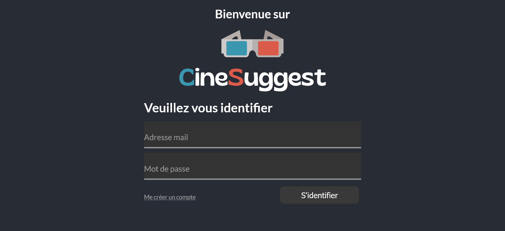
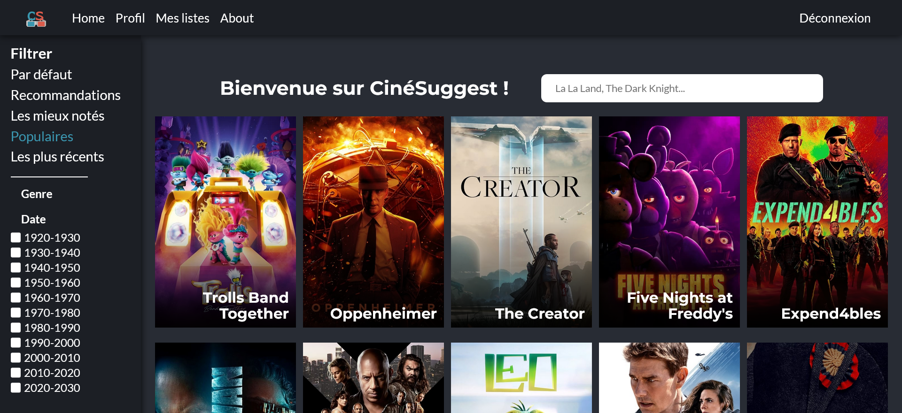

# Projet EI CentraleSupélec : Plateforme web de recommandation de films

## Présentation du projet

Ce projet s'inscrit dans le cadre des enseignements dispensés à CentraleSupélec. Le projet s'est déroulé sur une période d'une semaine du 26 mai au 2 juin 2023 pendant l'enseignement d'intégration (EI) intitulé "Une semaine pour développer une plateforme web de recommandation de films" en partenariat avec Théodo.

Au cours de ce projet, nous avons eu l'opportunité de mettre en pratique le contenu des cours dispensés dans le cadre de la séquence thématique "InfoNum - Web Data Intelligence" tout en découvrant une nouvelle technologie : ReactJS.

## Présentation de l'équipe

|Nom |Prénom |Adresse mail |
|--------|---------|--------|
|Bornet|Apolline|[apolline.bornet@student-cs.fr](mailto:apolline.bornet@student-cs.fr)|
|Descamps |Nicolas |[nicolas.descamps@student-cs.fr](mailto:nicolas.descamps@student-cs.fr)|
|Faure |Alexandre |[alexandre.faure@student-cs.fr](mailto:alexandre.faure@student-cs.fr)|

## Aperçu de l'application

Voici un aperçu de l'application web développée dans le cadre de ce projet.

Page de connexion :



Page d'accueil :



## Prise en main du code

### Backend

#### Project setup

```
cd backend
npm install
cp .env.example .env
```

#### Run database migrations

```
npm run migration:run
```

#### Start and auto-reload for development

```
npm run dev
```

#### Start for production

```
npm run start
```

#### Lint and fix files

```
npm run lint
```

### Frontend

#### Project setup

```
cd frontend
npm install
```

#### Compile and hot-reload for development

```
npm run dev
```

#### Compile and minifiy for production

```
npm run build
```

#### Lint and fix files

```
npm run lint
```
